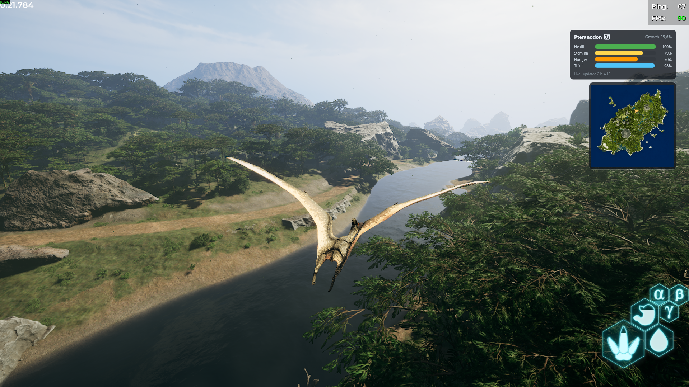
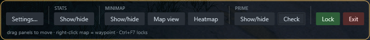
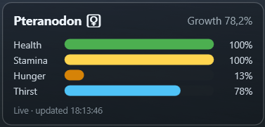
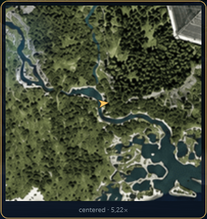
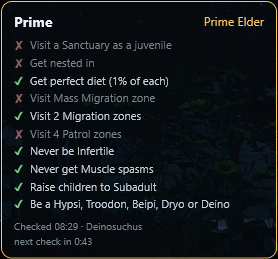

# Pandora Overlay

A tiny always-on-top overlay for The Isle: Evrima showing your dino's health, stamina, hunger, thirst, growth, and fracture status while playing on Isla Pandora — plus a minimap with your live position and heading.

It is **fully external**: the only thing it ever does is replay the same authenticated HTTPS request the islapandora.eu live-map page makes in your browser (`POST /api/map/mylocation`). It never reads game memory, never touches game files, and never interacts with the game process in any way.

[](https://github.com/DavidKatona/PandoraOverlay/actions)
[](https://github.com/DavidKatona/PandoraOverlay/releases/latest)
[](https://github.com/DavidKatona/PandoraOverlay/releases)
[](LICENSE)



## Contents

- [Get it](#get-it)
- [Requirements](#requirements)
- [Build](#build)
- [First-run setup](#first-run-setup)
- [Usage](#usage) — [Basics](#basics) · [Tray icon & settings](#tray-icon--settings) · [Stats panel](#stats-panel) · [Minimap](#minimap) · [Prime tracker](#prime-tracker)
- [Configuration (config.json)](#configuration-configjson)
- [Troubleshooting](#troubleshooting)
- [Fair-play notes](#fair-play-notes)
- [Roadmap](#roadmap)
- [License](#license)

## Get it

Download the latest zip from the [Releases page](../../releases) and unzip it anywhere — it needs the [.NET 8 Desktop Runtime](https://dotnet.microsoft.com/download/dotnet/8.0) installed. Or build from source as described below.

Windows will likely warn about an **unknown publisher** the first time you run a freshly downloaded version — the releases aren't code-signed, so every update starts with zero trust. See [Troubleshooting](#troubleshooting) for the quick fix.

## Requirements

- Windows 10/11, x64
- .NET 8 SDK (`winget install Microsoft.DotNet.SDK.8`) — only needed when building from source
- An Isla Pandora account, logged in via Discord on islapandora.eu
- The Isle running in **borderless windowed** mode (overlays cannot draw over exclusive fullscreen)

## Build

```
cd PandoraOverlay
dotnet build -c Release
dotnet test   # optional — runs the unit tests
```

The exe lands in `bin\Release\net8.0-windows\PandoraOverlay.exe`.

## First-run setup

1. Run `PandoraOverlay.exe` — the settings window opens automatically with the cookie walkthrough expanded.
2. Click **Open live map in browser** and log in with Discord.
3. On the live-map page press F12 → Network tab → type `mylocation` into the filter → click any row.
4. Under **Request Headers**, copy the whole value of `cookie` and paste it into the Account section's paste box. It validates as you type (it also cleans up stray quotes, a `cookie:` prefix, and line breaks automatically). Hit Save — the overlay connects immediately, no restart needed.

You can reopen settings any time: right-click the tray icon → **Settings…**, or press the edit-mode hotkey (**Ctrl+F7** by default) and use the control panel's Settings button.

The pasted cookie is encrypted with **Windows DPAPI** (scoped to your Windows user account) and stored in `config.json` as an opaque blob — it never sits readable on disk, and copying the file to another machine yields nothing usable. The session also rolls forward automatically: every response renews it, and the overlay re-encrypts and saves the refreshed value on exit, so this should be a one-time setup unless you log out or Cloudflare re-challenges the browser.

## Usage

### Basics

- The overlay starts **locked**: click-through, no focus stealing, invisible to Alt-Tab.
- The edit-mode hotkey (**Ctrl+F7** by default) toggles **edit mode** — the panel borders turn orange, you can drag them anywhere, and a **control panel** appears (bottom-center by default, draggable like everything else) with its buttons in one row, grouped by widget: **Settings**, then **Stats** (Show/hide), **Minimap** (Show/hide, Map view, Heatmap) and **Prime** (Show/hide, Check), and finally **Lock** and **Exit**. The hotkey (or Lock) locks everything back. Positions are remembered, and the panels never change size or move between modes.

  

- While dragging, panels **snap** to the screen edges, a small inset from them, and to each other — **guide lines** light up along whatever you snapped to (orange = screen, blue = the other panel). Hold **Alt** while dragging for pixel-perfect free placement.
- You can't lose a panel off-screen: locking edit mode (or restarting the app) pulls every panel fully back into view — dragging itself stays free, so moving panels to another monitor still works.
- **Ctrl+F4** hides/shows the whole overlay without quitting — for screenshots and cutscenes; polling continues, and the app always starts visible. Optionally the overlay also **hides itself while you aren't spawned in** (Settings → "Hide the overlay while not in-game"): after about 30 seconds of the spawn menu, a server restart or the game being closed, every widget disappears, and it's back on the first update that sees you in-game (that can trail your spawn by a few seconds). Ctrl+F4, the tray, edit mode or Check Prime bring it back sooner, for another 30 seconds or so (edit mode itself never hides); the tray tooltip reads "hidden until you spawn" meanwhile. Off by default — it's meant for people who start the overlay with Windows. **Ctrl+F5** flips the minimap view and **Ctrl+F6** flips the minimap's heatmap layer, both without entering edit mode. All four hotkeys are rebindable in Settings; the defaults deliberately avoid the game's F2 (recording) and F10 (hide HUD), and the quick toggles sit on the nearest keys.
- Only one copy runs at a time — launching a second shows a notice and exits.

### Tray icon & settings

- A **tray icon** in the notification area is always available: right-click for Edit mode, Hide/show overlay, Check Prime status, Settings, and **Exit** (double-click toggles edit mode). The menu is kept short on purpose: it holds what must work while the overlay is locked or hidden, and showing or hiding individual widgets is done from the control panel. Since the overlay has no taskbar presence, the tray menu is the easiest way to quit. Hovering the icon shows your live stats (dino · health · growth) at a glance.
- **Settings** (tray → Settings…, or the control panel in edit mode) gathers everything configurable: replace your cookie, rebind the hotkeys, start with Windows, set the minimap view, zoom and size, and adjust the background opacity. Every widget has its own size slider there — stats panel scale, prime tracker scale, map size — so you can size each one independently.
- On launch the overlay quietly checks GitHub for a **newer release**; if there is one, the tray tooltip and menu say so, and one click opens the download page. No popups, and offline it stays silent.

### Stats panel



- The stats panel can be **hidden** entirely (control panel → Stats → Show/hide) — the app keeps running from the tray, and hotkeys and the minimap stay live. Its size is adjustable with the "Stats panel scale" slider in Settings.

- The health, hunger and thirst bars **pulse** when they drop below 25% (stamina doesn't — it drains by design every sprint).
- After about five minutes of play, the growth readout gains an **estimated time to full growth** ("Growth 41.6% · ~3h 10m"), measured from your current growth speed — it's in-game time, and it adapts to server growth events and buffs. If growth stalls while you're spawned, the readout turns amber and shows "paused".
- The hunger and thirst bars show an **estimated time left** ("~40m") at the tip of the bar's fill once a stat has under about an hour to go, measured from how fast it is draining right now; it's back right after you eat or drink. It needs about three minutes of play first.
- Optional **attention fade** (Settings → "Fade the stats panel and Prime tracker when nothing needs attention", off by default): while all is well the two panels sit at a faded opacity you choose (20–80%), and come back to full when something is worth a look — a stat under 50%, a fracture, damage taken, hunger or thirst with under 15 minutes left; for the Prime tracker a check in flight, a fresh result, the cooldown ending, or the "as a different dino" cue appearing (each lit for about half a minute). The minimap never fades, and edit mode always shows everything in full. The fade works on top of the background opacity slider, so it can only make a panel fainter than your usual look. Don't want it? Untick "Show time left on the hunger and thirst bars" in Settings.
- Status-line states you'll see:
  - `Not in-game` — you're logged in but not spawned on the server (or the server is restarting). While you aren't spawned the overlay checks less often — every 15 seconds, and once a minute after ten minutes (the status line says so) — so a fresh spawn can take that long to show up. Entering edit mode, un-hiding the overlay or pressing Check Prime makes it look right away.
  - `Disconnected · retrying` — network/auth problem; it keeps retrying (less often once the failures pile up). If it never recovers, open Settings and paste a fresh cookie.
  - `Not set up yet` — no cookie stored; open Settings (tray icon → Settings…).

### Minimap



- The **minimap** is a separate window sharing the same edit mode: drag it independently, show or hide it from the control panel. Your arrow glides between updates and rotates with your facing. It adds zero extra requests — both windows feed off the same poll.
- Two views, toggled with the control panel's **Map view** button (or **Ctrl+F5** any time): the whole island (default), or **player-centered** (north-up, the map pans under a fixed arrow). In the centered view the mouse wheel zooms (1.25–6×) while in edit mode. Both the view and zoom are remembered (and also editable in Settings), and the footer under the map always shows the active view (and zoom).
- A **breadcrumb trail** draws the path you walked over the last 30 minutes (Off / 10 / 30 / 60 min in Settings), fading with age — handy for finding your way back to water, a nest or a body. It's drawn from the positions the overlay already receives, lives only for the session, and starts over when you die or switch dino; a relog on the same spot keeps it.
- A **scale bar** in the bottom-left corner shows a round real-world distance ("500 m", "2 km") for the current view and zoom. Untick "Show scale bar" in Settings to remove it.
- Right-click the minimap in edit mode to drop a **waypoint** — the footer shows your distance to it, and in the centered view an off-screen marker sticks to the panel edge pointing the way. Right-click the marker to clear it; it survives restarts.
- **Activity heatmap** (optional, off by default): press **Ctrl+F6** any time, or the control panel's **Heatmap** button, to overlay the server's live heatmap — the same image the website shows, complete with its player-count and timestamp caption — at the website's own 55% blend, in both views. It refreshes every minute while the minimap is visible; the image is public, so your login cookie is never sent for it. Expect the map colors to mute a little while it's on, and if the server disables the heatmap the layer quietly disappears until it returns.

### Prime tracker



- The **Prime tracker** is a third widget (docked to the left screen edge by default, draggable like the others) showing your Prime status and the server's ten Prime conditions as a ✓/✗ list — the same result as the website's "Prime Check" box. 5 of 10 are needed for Prime.
- It never checks by itself. Press **Check** in the control panel's Prime group, or **Check Prime status** in the tray menu (which works while locked, mid-game). The server enforces a cooldown between checks — 5 minutes normally, shorter with some supporter ranks — so after each check the overlay asks the server for *your* cooldown, counts it down in the widget, and remembers it across restarts. A click during the cooldown sends nothing. You need to be spawned in for a check to work.
- The last result stays on screen with the time it was taken and the dino it was taken as, and it survives restarts. If you have switched dino since, that line turns amber as a reminder that the list is about your previous one.
- Hide or show the widget with **Show/hide** in the control panel's Prime group. Its size has its own slider in Settings, "Prime tracker scale" (75–150%).

## Configuration (`config.json`)

| Field | Meaning |
|---|---|
| `Cookie` | Paste-here inbox only. Encrypted into `CookieProtected` and blanked on next launch. |
| `CookieProtected` | DPAPI-encrypted session cookie (base64). Managed by the app — don't edit, and it's useless off this machine/account. |
| `UserAgent` | Sent with every request; keep it matching your real browser. |
| `PollIntervalSeconds` | Default 3. Don't go below 2 — the site's own page polls at this pace and the API is rate-limited (300/window). This is the in-game pace; while you aren't spawned (or the connection keeps failing) the overlay slows itself to 15 s, then 60 s. |
| `WindowX` / `WindowY` | Saved panel position. |
| `Hotkey` / `HotkeyHideAll` / `HotkeyMinimapView` / `HotkeyHeatmap` | The four global hotkeys (edit mode `Ctrl+F7`, hide/show overlay `Ctrl+F4`, minimap view toggle `Ctrl+F5`, heatmap toggle `Ctrl+F6`); modifiers + one key. All rebindable in Settings. |
| `StatsEnabled` | Show the stats panel (toggled from the control panel). |
| `HideWhenNotInGame` | Hide every widget after ~30 s of not being spawned in, and show them again on the first in-game update. Checkbox in Settings. Default `false`. |
| `MinimapEnabled` | Show the minimap window (toggled from the control panel). |
| `MinimapX` / `MinimapY` / `MinimapSize` | Minimap position and edge length (size slider in Settings, 160–400). |
| `MinimapMode` | `island` (whole map, arrow moves) or `centered` (map pans under a fixed arrow). Map view button / Ctrl+F5 toggles it. |
| `MinimapZoom` | Centered-view magnification, clamped to 1.25–6 (default 5). Mouse wheel in edit mode adjusts it. |
| `MinimapYawOffsetDegrees` | Rotation added to the raw yaw for the arrow. Default 90 matches the current map. |
| `MinimapTrailMinutes` | Minutes of recent path drawn on the minimap as a breadcrumb trail; `0` = off. Default 30; Settings offers Off / 10 / 30 / 60. |
| `MinimapScaleBarEnabled` | Show the scale bar in the minimap's bottom-left corner. Checkbox in Settings. Default `true`. |
| `HeatmapEnabled` | Overlay the server's live activity heatmap on the minimap (refreshed every minute; public image, no cookie sent). Toggled with the heatmap hotkey or the control panel's Heatmap button. Default `false`. |
| `PrimeEnabled` / `PrimeX` / `PrimeY` | Show the Prime tracker widget, and its position (empty until first placed: left screen edge, vertically centered). |
| `Prime` / `PrimeCooldownUntilUtc` | The last Prime check result (status, ten condition flags, time, dino) and when the server will accept the next check, kept so the widget is right after a restart. Managed by the app. |
| `Calibration` | Cached world→map constants from the site, refreshed once per launch. Managed by the app. |
| `WaypointX` / `WaypointY` | The minimap waypoint in world coordinates; `null` when none is set. Right-click the minimap in edit mode. |
| `UiScale` | Stats panel (and control panel) scale, 0.75–1.5 (default 1). Slider in Settings; the minimap sizes natively via `MinimapSize`. |
| `PrimeScale` | Prime tracker scale, 0.75–1.5. Slider in Settings; starts out equal to `UiScale`. |
| `BackgroundOpacity` | Panel-glass opacity, 0.3–1 (default 0.8) — text stays crisp. Slider in Settings. |
| `StatTimeLeftEnabled` | Show the estimated time left inside the hunger and thirst bars. Checkbox in Settings. Default `true`. |
| `FadeEnabled` / `FadeIdleOpacity` | Attention fade for the stats panel and Prime tracker, and the opacity they rest at while nothing needs attention (0.2–0.8, default 0.4). Checkbox + slider in Settings. Default off. |

Most of these are editable from the Settings window; `UserAgent`, `PollIntervalSeconds`, and `MinimapYawOffsetDegrees` are file-only on purpose. "Start with Windows" lives in the registry (HKCU Run entry), not in this file.

## Troubleshooting

- **`Disconnected (HttpRequestException)` or 401/403 forever** → your session or `cf_clearance` expired. Redo the cookie copy from DevTools.
- **Overlay not visible over the game** → make sure the game is borderless windowed, not fullscreen.
- **The hotkey does nothing** → another app grabbed it; pick a different combination in Settings (tray icon → Settings…) — the capture box checks availability as you press.
- **Bars frozen** → check the timestamp in the status line; it updates on every successful poll.
- **Windows blocks the app / "unknown publisher"** → expected for every new version, not just the first install: the releases aren't code-signed, and Windows trusts exact files, not app names — each update is new files with no reputation yet. Either click **More info → Run anyway** on the SmartScreen warning, or cleaner: right-click the downloaded **zip** → Properties → tick **Unblock** → OK *before* extracting, which clears every file inside. If the dialog names `PandoraOverlay.dll` and offers no "Run anyway" button, that's Windows 11's **Smart App Control**, which blocks all unsigned apps machine-wide with no per-app exception — it can only be switched off entirely in Windows Security (App & browser control), and that switch is one-way.

## Fair-play notes

- The overlay only shows **your own** dino — the same data Isla Pandora already displays to you in a browser tab. It cannot see other players (except the site's own friends feature, not used yet).
- It polls at the same rate as the website itself while you play, slows right down while you aren't spawned in, and respects their rate limit.
- This consumes Isla Pandora's private, login-gated API. Be a good citizen: ask their admins whether they're okay with a personal overlay client, and stop using it if they say no.

## Roadmap

- Friends markers from the `friends` endpoint *(needs a green light from the site dev first)*.
- Zone overlays (sanctuaries, patrol zones, migrations) *(same — ask first)*.

## License

MIT — see [LICENSE](LICENSE).
