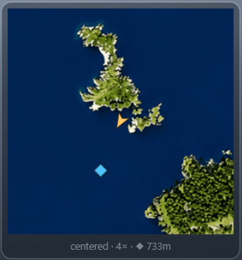

# Pandora Overlay

A tiny always-on-top overlay for The Isle: Evrima showing your dino's health, stamina, hunger, thirst, growth, and fracture status while playing on Isla Pandora — plus a minimap with your live position and heading.

It is **fully external**: the only thing it ever does is replay the same authenticated HTTPS request the islapandora.eu live-map page makes in your browser (`POST /api/map/mylocation`). It never reads game memory, never touches game files, and never interacts with the game process in any way.

[](https://github.com/DavidKatona/PandoraOverlay/actions)
[](https://github.com/DavidKatona/PandoraOverlay/releases/latest)
[](https://github.com/DavidKatona/PandoraOverlay/releases)
[](LICENSE)


## Contents

- [Get it](#get-it)
- [Requirements](#requirements)
- [Build](#build)
- [First-run setup](#first-run-setup)
- [Usage](#usage) — [Basics](#basics) · [Tray icon & settings](#tray-icon--settings) · [Stats panel](#stats-panel) · [Minimap](#minimap)
- [Configuration (config.json)](#configuration-configjson)
- [Troubleshooting](#troubleshooting)
- [Fair-play notes](#fair-play-notes)
- [Roadmap](#roadmap)
- [License](#license)

## Get it

Download the latest zip from the [Releases page](../../releases) and unzip it anywhere — it needs the [.NET 8 Desktop Runtime](https://dotnet.microsoft.com/download/dotnet/8.0) installed. Or build from source as described below.

## Requirements

- Windows 10/11, x64
- .NET 8 SDK (`winget install Microsoft.DotNet.SDK.8`) — only needed when building from source
- An Isla Pandora account, logged in via Discord on islapandora.eu
- The Isle running in **borderless windowed** mode (overlays cannot draw over exclusive fullscreen)

## Build

```
cd PandoraOverlay
dotnet build -c Release
dotnet test   # optional — runs the unit tests
```

The exe lands in `bin\Release\net8.0-windows\PandoraOverlay.exe`.

## First-run setup

1. Run `PandoraOverlay.exe` — the settings window opens automatically with the cookie walkthrough expanded.
2. Click **Open live map in browser** and log in with Discord.
3. On the live-map page press F12 → Network tab → type `mylocation` into the filter → click any row.
4. Under **Request Headers**, copy the whole value of `cookie` and paste it into the Account section's paste box. It validates as you type (it also cleans up stray quotes, a `cookie:` prefix, and line breaks automatically). Hit Save — the overlay connects immediately, no restart needed.

You can reopen settings any time: right-click the tray icon → **Settings…**, or press the edit-mode hotkey (**Ctrl+F3** by default) and use the control panel's Settings button.

The pasted cookie is encrypted with **Windows DPAPI** (scoped to your Windows user account) and stored in `config.json` as an opaque blob — it never sits readable on disk, and copying the file to another machine yields nothing usable. The session also rolls forward automatically: every response renews it, and the overlay re-encrypts and saves the refreshed value on exit, so this should be a one-time setup unless you log out or Cloudflare re-challenges the browser.

## Usage

### Basics

- The overlay starts **locked**: click-through, no focus stealing, invisible to Alt-Tab.
- The edit-mode hotkey (**Ctrl+F3** by default) toggles **edit mode** — the panel borders turn orange, you can drag them anywhere, and a **control panel** appears (bottom-center by default, draggable like everything else) with labeled buttons: **Settings**, **Show/hide minimap**, **Map view**, **Lock**, and **Exit**. The hotkey (or Lock) locks everything back. Positions are remembered, and the panels never change size or move between modes.
- While dragging, panels **snap** to the screen edges, a small inset from them, and to each other — **guide lines** light up along whatever you snapped to (orange = screen, blue = the other panel). Hold **Alt** while dragging for pixel-perfect free placement.
- You can't lose a panel off-screen: locking edit mode (or restarting the app) pulls every panel fully back into view — dragging itself stays free, so moving panels to another monitor still works.
- **Ctrl+F4** hides/shows the whole overlay without quitting — for screenshots and cutscenes; polling continues, and the app always starts visible. **Ctrl+F5** flips the minimap view without entering edit mode. All three hotkeys are rebindable in Settings; the defaults deliberately avoid the game's F2 (recording) and F10 (hide HUD).
- Only one copy runs at a time — launching a second shows a notice and exits.

### Tray icon & settings

- A **tray icon** in the notification area is always available: right-click for Edit mode, Show/hide minimap, Settings, and **Exit** (double-click toggles edit mode). Since the overlay has no taskbar presence, the tray menu is the easiest way to quit. Hovering the icon shows your live stats (dino · health · growth) at a glance.
- **Settings** (tray → Settings…, or the control panel in edit mode) gathers everything configurable: replace your cookie, rebind the hotkeys, start with Windows, set the minimap view, zoom and size, and adjust the stats panel scale and background opacity.
- On launch the overlay quietly checks GitHub for a **newer release**; if there is one, the tray tooltip and menu say so, and one click opens the download page. No popups, and offline it stays silent.

### Stats panel


- The stats panel can be **hidden** entirely (control panel → Show/hide stats, or the tray menu) — the app keeps running from the tray, and hotkeys and the minimap stay live. Its size is adjustable with the "Stats panel scale" slider in Settings.

- The health, hunger and thirst bars **pulse** when they drop below 25% (stamina doesn't — it drains by design every sprint).
- After about five minutes of play, the growth readout gains an **estimated time to full growth** ("Growth 41.6% · ~3h 10m"), measured from your current growth speed — it's in-game time, and it adapts to server growth events and buffs. If growth stalls while you're spawned, the readout turns amber and shows "paused".
- Status-line states you'll see:
  - `Not in-game` — you're logged in but not spawned on the server (or the server is restarting).
  - `Disconnected · retrying` — network/auth problem; it keeps retrying every poll. If it never recovers, open Settings and paste a fresh cookie.
  - `Not set up yet` — no cookie stored; open Settings (tray icon → Settings…).

### Minimap

- The **minimap** is a separate window sharing the same edit mode: drag it independently, show or hide it from the control panel (or the tray menu). Your arrow glides between updates and rotates with your facing. It adds zero extra requests — both windows feed off the same poll.
- Two views, toggled with the control panel's **Map view** button (or **Ctrl+F5** any time): the whole island (default), or **player-centered** (north-up, the map pans under a fixed arrow). In the centered view the mouse wheel zooms (1.25–6×) while in edit mode. Both the view and zoom are remembered (and also editable in Settings), and the footer under the map always shows the active view (and zoom).
- Right-click the minimap in edit mode to drop a **waypoint** — the footer shows your distance to it, and in the centered view an off-screen marker sticks to the panel edge pointing the way. Right-click the marker to clear it; it survives restarts.

  

## Configuration (`config.json`)

| Field | Meaning |
|---|---|
| `Cookie` | Paste-here inbox only. Encrypted into `CookieProtected` and blanked on next launch. |
| `CookieProtected` | DPAPI-encrypted session cookie (base64). Managed by the app — don't edit, and it's useless off this machine/account. |
| `UserAgent` | Sent with every request; keep it matching your real browser. |
| `PollIntervalSeconds` | Default 3. Don't go below 2 — the site's own page polls at this pace and the API is rate-limited (300/window). |
| `WindowX` / `WindowY` | Saved panel position. |
| `Hotkey` / `HotkeyHideAll` / `HotkeyMinimapView` | The three global hotkeys (edit mode `Ctrl+F3`, hide/show overlay `Ctrl+F4`, minimap view toggle `Ctrl+F5`); modifiers + one key. All rebindable in Settings. |
| `StatsEnabled` | Show the stats panel (toggled from the control panel or the tray menu). |
| `MinimapEnabled` | Show the minimap window (toggled from the control panel or the tray menu). |
| `MinimapX` / `MinimapY` / `MinimapSize` | Minimap position and edge length (size slider in Settings, 160–400). |
| `MinimapMode` | `island` (whole map, arrow moves) or `centered` (map pans under a fixed arrow). Map view button / Ctrl+F5 toggles it. |
| `MinimapZoom` | Centered-view magnification, clamped to 1.25–6 (default 5). Mouse wheel in edit mode adjusts it. |
| `MinimapYawOffsetDegrees` | Rotation added to the raw yaw for the arrow. Default 90 matches the current map. |
| `Calibration` | Cached world→map constants from the site, refreshed once per launch. Managed by the app. |
| `WaypointX` / `WaypointY` | The minimap waypoint in world coordinates; `null` when none is set. Right-click the minimap in edit mode. |
| `UiScale` | Stats panel (and control panel) scale, 0.75–1.5 (default 1). Slider in Settings; the minimap sizes natively via `MinimapSize`. |
| `BackgroundOpacity` | Panel-glass opacity, 0.3–1 (default 0.8) — text stays crisp. Slider in Settings. |

Most of these are editable from the Settings window; `UserAgent`, `PollIntervalSeconds`, and `MinimapYawOffsetDegrees` are file-only on purpose. "Start with Windows" lives in the registry (HKCU Run entry), not in this file.

## Troubleshooting

- **`Disconnected (HttpRequestException)` or 401/403 forever** → your session or `cf_clearance` expired. Redo the cookie copy from DevTools.
- **Overlay not visible over the game** → make sure the game is borderless windowed, not fullscreen.
- **The hotkey does nothing** → another app grabbed it; pick a different combination in Settings (tray icon → Settings…) — the capture box checks availability as you press.
- **Bars frozen** → check the timestamp in the status line; it updates on every successful poll.

## Fair-play notes

- The overlay only shows **your own** dino — the same data Isla Pandora already displays to you in a browser tab. It cannot see other players (except the site's own friends feature, not used yet).
- It polls at the same rate as the website itself and respects their rate limit.
- This consumes Isla Pandora's private, login-gated API. Be a good citizen: ask their admins whether they're okay with a personal overlay client, and stop using it if they say no.

## Roadmap

- Friends markers from the `friends` endpoint *(needs a green light from the site dev first)*.
- Zone overlays (sanctuaries, patrol zones, migrations) *(same — ask first)*.

## License

MIT — see [LICENSE](LICENSE).
