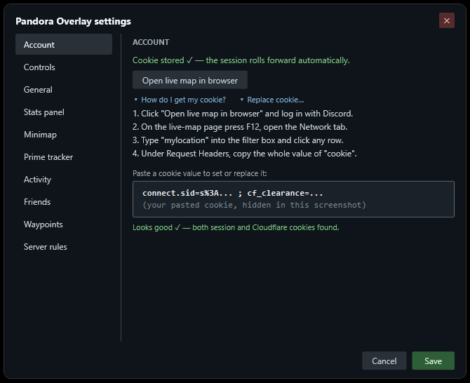
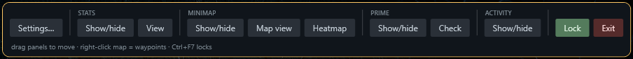
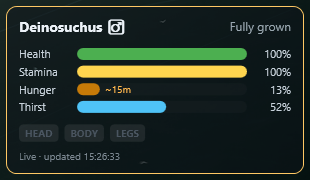
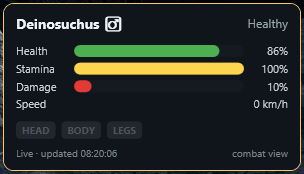
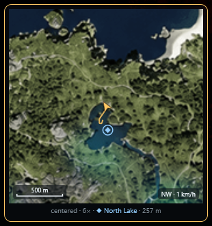
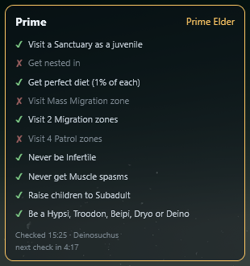
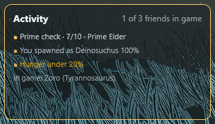

# Pandora Overlay

A small always-on-top overlay for The Isle: Evrima on the Isla Pandora server. While you play it shows your dino's health, stamina, hunger, thirst, growth and fractures, a minimap with your live position, your waypoints and your friends, your Prime status, a feed of what just happened, and the server rules.

It is **fully external**: all it knows about the game comes from the same logged-in HTTPS requests the islapandora.eu website makes in your browser when you look at its live map. It never reads game memory, never touches game files, and never interacts with the game process in any way.

[](https://github.com/DavidKatona/PandoraOverlay/actions)
[](https://github.com/DavidKatona/PandoraOverlay/releases/latest)
[](https://github.com/DavidKatona/PandoraOverlay/releases)
[](LICENSE)


## Contents

- **Getting started:** [Get it](#get-it) · [Requirements](#requirements) · [Build](#build) · [First-run setup](#first-run-setup)
- **[Usage](#usage)**
  - [Basics](#basics) — edit mode, snapping, hotkeys, hiding
  - [Tray icon & settings](#tray-icon--settings)
  - Widgets: [Stats panel](#stats-panel) · [Minimap](#minimap) · [Prime tracker](#prime-tracker) · [Activity feed](#activity-feed)
  - Features: [Waypoints](#waypoints) · [Friends](#friends) · [Server rules](#server-rules)
- **Help:** [FAQ](#faq) — can't see the overlay, how to close it, updating, and more · [Troubleshooting](#troubleshooting)
- **Reference:** [Configuration (config.json)](#configuration-configjson) · [Fair-play notes](#fair-play-notes) · [Roadmap](#roadmap) · [License](#license)

## Get it

Download the latest zip from the [Releases page](../../releases) and unzip it anywhere — it needs the [.NET 8 Desktop Runtime](https://dotnet.microsoft.com/download/dotnet/8.0) installed. Or build from source as described below.

Windows will likely warn about an **unknown publisher** the first time you run a freshly downloaded version — the releases aren't code-signed, so every update starts with zero trust. See [Troubleshooting](#troubleshooting) for the quick fix.

## Requirements

- Windows 10/11, x64
- The [.NET 8 Desktop Runtime](https://dotnet.microsoft.com/download/dotnet/8.0) to run a release
- .NET 8 SDK (`winget install Microsoft.DotNet.SDK.8`) — only needed when building from source
- An Isla Pandora account, logged in via Discord on islapandora.eu
- The Isle running in **borderless windowed** mode (overlays cannot draw over exclusive fullscreen)

## Build

```
cd PandoraOverlay
dotnet build -c Release
dotnet test   # optional — runs the unit tests
```

The exe lands in `bin\Release\net8.0-windows\PandoraOverlay.exe`.

## First-run setup

1. Run `PandoraOverlay.exe` — the settings window opens automatically with the cookie walkthrough expanded.

   

2. Click **Open live map in browser** and log in with Discord.
3. On the live-map page press F12 → Network tab → type `mylocation` into the filter → click any row.
4. Under **Request Headers**, copy the whole value of `cookie` (right-click the value → **Copy value** gets all of it in one go) and paste it into the Account section's paste box. It validates as you type (it also cleans up stray quotes, a `cookie:` prefix, and line breaks automatically). Hit Save — the overlay connects immediately, no restart needed.

   

   

   The cookie is your login: copy it straight from DevTools into the overlay and never post it or a screenshot of it anywhere.

You can reopen settings any time: right-click the tray icon → **Settings…**, or press the edit-mode hotkey (**Ctrl+F7** by default) and use the control panel's Settings button.

The pasted cookie is encrypted with **Windows DPAPI** (scoped to your Windows user account) and stored in `config.json` as an opaque blob — it never sits readable on disk, and copying the file to another machine yields nothing usable. The session also rolls forward automatically: every response renews it, and the overlay re-encrypts and saves the refreshed value on exit, so this should be a one-time setup unless you log out or Cloudflare re-challenges the browser.

## Usage

### Basics

- The overlay starts **locked**: click-through, no focus stealing, invisible to Alt-Tab.
- On a fresh install the panels come up in **two columns**, starting just under the game's own top HUD readouts: the Prime tracker at the top-left with the Activity feed under it, the minimap at the top-right with the stats panel under it. The minimap and Prime tracker are the same size, as are the stats panel and Activity feed, so the columns match. Drag anything anywhere afterwards; **Reset positions** in Settings → General puts them all back (sizes stay as you set them).
- The edit-mode hotkey (**Ctrl+F7** by default) toggles **edit mode** — the panel borders turn orange, you can drag them anywhere, and a **control panel** appears (bottom-center by default, draggable like everything else) with its buttons in one row, grouped by widget: **Settings**, then **Stats** (Show/hide, View), **Minimap** (Show/hide, Map view, Heatmap), **Prime** (Show/hide, Check) and **Activity** (Show/hide), and finally **Lock** and **Exit**. The hotkey (or Lock) locks everything back. Positions are remembered, and the panels never change size or move between modes.

  

- While dragging, panels **snap** to the screen edges, a small inset from them, and to each other — **guide lines** light up along whatever you snapped to (orange = screen, blue = the other panel). Hold **Alt** while dragging for pixel-perfect free placement.
- You can't lose a panel off-screen: locking edit mode (or restarting the app) pulls every panel fully back into view — dragging itself stays free, so moving panels to another monitor still works.
- **Ctrl+F4** hides/shows the whole overlay without quitting — for screenshots and cutscenes; polling continues, and the app always starts visible. Optionally the overlay also **hides itself while you aren't spawned in** (Settings → "Hide the overlay while not in-game"): after about 30 seconds of the spawn menu, a server restart or the game being closed, every widget disappears, and it's back on the first update that sees you in-game (that can trail your spawn by a few seconds). Ctrl+F4, the tray, edit mode or Check Prime bring it back sooner, for another 30 seconds or so (edit mode itself never hides); the tray tooltip reads "hidden until you spawn" meanwhile. Off by default — it's meant for people who start the overlay with Windows. **Ctrl+F5** flips the minimap view, **Ctrl+F6** flips the minimap's heatmap layer, **Ctrl+F8** runs a Prime check and **Ctrl+F9** flips the stats panel between its Survival and Combat views, all without entering edit mode. All six hotkeys are rebindable in Settings; the defaults deliberately avoid the game's F2 (recording) and F10 (hide HUD), and the quick toggles sit on the nearest keys.
- Only one copy runs at a time — launching a second shows a notice and exits.

### Tray icon & settings

- A **tray icon** in the notification area is always available: right-click for Edit mode, Hide/show overlay, Settings, Server rules, and **Exit** (double-click toggles edit mode). The menu is kept short on purpose: it holds what must work while the overlay is locked or hidden; showing or hiding individual widgets is done from the control panel, and mid-game actions such as Check Prime have a hotkey instead. Since the overlay has no taskbar presence, the tray menu is the easiest way to quit. Hovering the icon shows your live stats (dino · health · growth) at a glance.
- **Settings** (tray → Settings…, or the control panel in edit mode) gathers everything configurable, as pages picked from a list on the left: Account (your cookie), Controls (the hotkeys), General (start with Windows, hide while not in-game, background opacity, the attention fade, Reset positions), then one page per widget — Stats panel, Minimap, Prime tracker, Activity — each with its own Scale slider (75–150%), so you can size each one independently, then Friends, Waypoints and Server rules.
- On launch the overlay quietly checks GitHub for a **newer release**; if there is one, the tray tooltip and menu say so, and one click opens the download page. No popups, and offline it stays silent.

### Stats panel



- The stats panel can be **hidden** entirely (control panel → Stats → Show/hide) — the app keeps running from the tray, and hotkeys and the minimap stay live. Its size is adjustable with the Scale slider in Settings → Stats panel.

- The health, hunger and thirst bars **pulse** when they drop below 25% (stamina doesn't — it drains by design every sprint). The three **fracture badges** (HEAD, BODY, LEGS) are always on the panel, dim until that part is actually fractured.
- Every widget is one of **two sizes**: the minimap and the Prime tracker share one, the stats panel and the Activity feed the other, all the same width, and nothing on them can change their size while you play. That is what keeps docked layouts docked.
- After about five minutes of play, the growth readout gains an **estimated time to full growth** ("Growth 41.6% · ~3h 10m"), measured from your current growth speed — it's in-game time, and it adapts to server growth events and buffs. If growth stalls while you're spawned, the readout turns amber and shows "paused".
- The hunger and thirst bars show an **estimated time left** ("~40m") at the tip of the bar's fill once a stat has under about an hour to go, measured from how fast it is draining right now; it's back right after you eat or drink. It needs about three minutes of play first. Don't want it? Untick "Show time left on the hunger, thirst and stamina bars" in Settings → Stats panel.
- The stamina bar has a **timer** of its own, and it reads both ways: while stamina is draining (a sprint, a swim) it shows how long until it's empty ("~25s"), and while it's recovering it shows how long until it's full ("full ~40s"). It appears about six seconds into a steady run of either and disappears the moment stamina holds still, so it's never a stale number. The same Settings checkbox as the hunger and thirst labels turns it off.
- **Two views, Survival and Combat:** press **Ctrl+F9** (or **View** in the control panel's Stats group) to flip between them. Survival is everything above. Combat keeps health, stamina and the fracture badges and swaps hunger and thirst for two fight readouts: **Damage**, the health you have lost in this fight as a red bar that grows with every hit (bleeding counts, healing doesn't take it back, and it clears 30 seconds after the last hit), and **Speed**, your current speed in km/h. The top-right corner, where Survival shows growth, reads **Wounded** once your health is under 50% (the game's own term) and "Healthy" otherwise. The rows keep their size and place, so nothing moves when you flip, and the panel's footer names the view you are in. Settings → Stats panel picks which view it starts in. Readings arrive once per poll (every 3 seconds by default), so treat them as a readout, not a hit counter.

  

- The growth readout **blinks for a few seconds when you reach a stage** — 25% juvenile, 50% subadult, 75% adult, 100% elder. Two optional **chimes** (Settings → Stats panel, both off by default) play the Windows "Exclamation" sound: one when hunger or thirst drops under 20% (repeated every five minutes while it stays there, re-armed once you've eaten or drunk), one at those growth stages. Made for AFK growing, where a slow stat is easy to miss while alt-tabbed.
- Optional **attention fade** (Settings → General → "Fade idle panels to …", off by default): while all is well the stats panel, the Prime tracker and the Activity feed sit at a faded opacity you choose (20–80%), and come back to full when something is worth a look. For the stats panel that is a stat under 50%, a fracture, damage taken, hunger or thirst with under 15 minutes left (in the Combat view instead: health or stamina under 75%, a fracture, or a fight still showing on the Damage row; flipping the view always lights the panel for a few seconds); for the Prime tracker a check in flight, a fresh result, the cooldown ending, or the "as a different dino" cue appearing (each lit for about half a minute); for the Activity feed a new line (also about half a minute). The minimap never fades, and edit mode always shows everything in full. The fade works on top of the background opacity slider, so it can only make a panel fainter than your usual look.
- Status-line states you'll see:
  - `Not in-game` — you're logged in but not spawned on the server (or the server is restarting). While you aren't spawned the overlay checks less often — every 15 seconds, and once a minute after ten minutes (the status line says so) — so a fresh spawn can take that long to show up. Entering edit mode, un-hiding the overlay or pressing Check Prime makes it look right away.
  - `Disconnected · retrying` — network/auth problem; it keeps retrying (less often once the failures pile up). If it never recovers, open Settings and paste a fresh cookie.
  - `Not set up yet` — no cookie stored; open Settings (tray icon → Settings…).

### Minimap



- The **minimap** is a separate window sharing the same edit mode: drag it independently, show or hide it from the control panel. Your arrow glides between updates and rotates with your facing. It adds zero extra requests — both windows feed off the same poll.
- Two views, toggled with the control panel's **Map view** button (or **Ctrl+F5** any time): the whole island (default), or **player-centered** (north-up, the map pans under a fixed arrow). In the centered view the mouse wheel zooms (1.25–6×) while in edit mode. Both the view and zoom are remembered (and also editable in Settings), and the footer under the map always shows the active view (and zoom).
- A **breadcrumb trail** draws the path you walked over the last 30 minutes (Off / 10 / 30 / 60 min in Settings), fading with age — handy for finding your way back to water, a nest or a body. It's drawn from the positions the overlay already receives, lives only for the session, and starts over when you die or switch dino; a relog on the same spot keeps it.
- A **scale bar** in the bottom-left corner shows a round real-world distance ("500 m", "2 km") for the current view and zoom. Untick "Show scale bar" in Settings to remove it.
- **Waypoints** are drawn on the map as small dots in their colours; the one you're **tracking** is a ringed diamond, and in the centered view it sticks to the panel edge pointing the way when off-screen. The footer follows it by name with the distance and, while you're actually heading for it, an ETA at your current pace ("◆ Nest 1.2 km · ~6 min"); with nothing tracked it follows the nearest one. See **Waypoints** below.
- A **heading and speed** pill in the bottom-right corner shows your compass heading and km/h, measured from your last few positions. Untick "Show heading and speed" in Settings to remove it.
- **Friends** who are in game and sharing their location appear as smaller arrows in their own colours, turning with their heading. See **Friends** below.
- **Activity heatmap** (optional, off by default): press **Ctrl+F6** any time, or the control panel's **Heatmap** button, to overlay the server's live heatmap — the same image the website shows, complete with its player-count and timestamp caption — at the website's own 55% blend, in both views. It refreshes every minute while the minimap is visible; the image is public, so your login cookie is never sent for it. Expect the map colors to mute a little while it's on, and if the server disables the heatmap the layer quietly disappears until it returns.

### Waypoints

- A **library of up to 256 named places**, each with one of twelve colours, kept in `waypoints.json` next to the app. Sanctuaries, patrol zones, nests, water, "lots of AI around here": whatever you want to find again.
- **Adding one:** right-click the minimap in edit mode and pick **Waypoint here**. It's named "Waypoint 7" and tracked straight away; rename and recolour it in Settings → Waypoints. Right-clicking on an existing marker offers **Track / Copy / Remove** for that one. In edit mode, hovering a marker shows its name in the footer.
- **Managing them:** Settings → Waypoints lists every waypoint: click the dot to cycle its colour, edit the name, tick **Show** to draw it or not, pick **Track** (click the tracked one again to untrack), ✕ to delete. Changes apply on Save; Cancel drops them. "Delete all" asks twice.
- **Keeping the map readable:** Settings → Minimap → Waypoints chooses what's drawn — all visible ones, only the tracked one, or the nearest ten. The tracked one is always drawn.
- **Share a spot** from the map menu: "Copy this spot" puts the point you right-clicked on the clipboard as a short code like `pandora:62,-3168`, "Copy my position" does the same for where you are, and "Copy Nest" on a marker includes its name (`pandora:62,-3168 Nest`). "Paste waypoint" turns a code someone sent you into a new, tracked waypoint, named from the code if it carries a name. The code is a snapshot of a position, nothing is tracked live and nothing goes to the site.
- **Sharing a library:** Settings → Waypoints → **Export…** writes your waypoints to a small JSON file (a "pack", named after the file), which you can post on Discord. **Import…** reads one in: waypoints you already have, by id or by the same name within 20 m, are skipped, and the rest arrive **hidden** under their own heading, whose Show checkbox shows or hides the whole pack and whose ✕ deletes it, so a 200-entry pack can't bury your map. Packs are for places that stay put: sanctuaries, patrol zones, migration zones, landmarks, "lots of AI around here".
- **Ready-made packs:** the [`packs`](packs/) folder has five packs to import: the island's place names (26 areas, 27 lakes, ponds and rivers, 27 landmarks and human sites), 18 mud pools and 24 salt rocks. Its [readme](packs/README.md) shows the import step by step. The names and positions come from the community-made [VulnonaMAP](https://vulnona.com/game/map/).
- Your waypoints from earlier versions are carried over as Blue, Green and Purple.

### Prime tracker



- The **Prime tracker** is a third widget (top-left by default, draggable like the others) showing your Prime status and the server's ten Prime conditions as a ✓/✗ list — the same result as the website's "Prime Check" box. 5 of 10 are needed for Prime.
- It never checks by itself. Press **Ctrl+F8** any time (rebindable in Settings), or **Check** in the control panel's Prime group. The server enforces a cooldown between checks — 5 minutes normally, shorter with some supporter ranks — so after each check the overlay asks the server for *your* cooldown, counts it down in the widget, and remembers it across restarts. A click during the cooldown sends nothing. You need to be spawned in for a check to work.
- The last result stays on screen with the time it was taken and the dino it was taken as, and it survives restarts. If you have switched dino since, that line turns amber as a reminder that the list is about your previous one. After a check, conditions that changed since the previous result stand out — a newly met one in bright text, a lost one in amber — until the next check. When the cooldown runs out, the footer blinks briefly.
- Hide or show the widget with **Show/hide** in the control panel's Prime group. Its size has its own Scale slider in Settings → Prime tracker (75–150%).

### Activity feed



- The **Activity widget** (a fourth panel, docked under the Prime tracker by default) is a feed of the last ten minutes: each line reports something that just happened, newest at the top, fading as it ages. Every other cue on the overlay is momentary — the growth readout blinks, a chime plays once — so this is the one you can read after a fight or when you come back to the keyboard. With friends' events included, its header also says how many friends you have and how many are in game.
- **Your friends' events** (on by default): a friend spawned in ("spawned as Deinosuchus 42%"), left the game, started a fresh dino of the same species, switched dino, reached a growth stage, took a fracture, came within 200 m of you, or joined or left your list. Several friends leaving at once (a server restart) become one line, and "left the game" is worded neutrally on purpose — from outside, a logout, a restart and a death look the same.
- **Your own events**, always: you spawned in or started a fresh dino, reached a growth stage, dropped under 20% hunger or thirst (with the time left), took a fracture, and each Prime check as what *changed* — "Prime · now met: Visit 2 Migration zones" — or a one-line summary when nothing did. An optional line for damage taken (a drop of 5% or more, at most one per half minute) is off by default, since a long fight would fill the feed. Friends' events are the extra: "Include friends' events" in Settings → Activity is on by default; untick it and the widget is your own log alone, and no friends list is fetched for it.
- Your lines carry an orange dot (your arrow's colour), a friend's their own colour. When nothing recent happened the first line names who is in game. The widget shows six lines and keeps one size; its Scale slider is in Settings → Activity.

### Friends

- On the **minimap**, friends who are in game appear as smaller arrows in their own colours. Right-click one in edit mode to **Track** them (a ring on their arrow, and the footer shows their name, distance and ETA — the same way it follows a tracked waypoint) or to drop a **Waypoint at** their position. In edit mode, hovering a friend's arrow names them in the footer.
- An optional **chime** (Settings → Friends, off by default) plays the Windows "Exclamation" sound when a friend spawns in, whether or not the Activity widget is on screen.
- **Settings → Friends** lists everyone on your friends list, in-game friends first: click the colour to change it (each friend gets a stable default colour), type a **nickname** that only you see, untick **Map** to keep a friend off the minimap or **Feed** to mute their lines, and pick **Track**. The "Last seen" column shows when the overlay last saw them in game and, on hover, as what. Your choices live in `friends.json` next to the app; adding, removing or blocking friends, and hiding your own location, are done on the website ("Manage on islapandora.eu" opens the page).
- Privacy works the way the website's does: a friend who turned on "hide my location" is counted as in game but never drawn, and you appear to your friends exactly as you do on their live map. The overlay only ever reads the friends list; it never sends friend requests or changes any setting there.
- Cost: while the Activity widget includes friends' events or the minimap draws friends, the friends list is fetched every second update while you play (every 6 seconds at the default pace) and once per idle check while you aren't spawned — less often than the website's own live map does. Untick "Include friends' events" and "Show friends on the minimap" to send no friends requests at all.

### Server rules


- **Settings → Server rules** (or the tray's **Server rules…**, which opens straight there) shows Isla Pandora's pack limits per species, with your current dino's limit highlighted, and the numbered server rules — so "can we run five Ceratos?" is answered without alt-tabbing.
- It's a dated copy of the website's rules page, kept with the app; the page says when it was copied and links to the site and the Discord. As the website itself notes, the rules on the Discord have priority. The site has no rules API yet, so the copy is updated with the app; if one appears, the overlay will fetch it instead.

## FAQ

### Seeing and closing it

**I can't see the overlay. Why?** Go down this list:

1. **Is it running?** Look for its icon in the notification area next to the clock (it may be tucked under the **^** arrow). No icon means it isn't running: start `PandoraOverlay.exe`.
2. **Is it hidden?** **Ctrl+F4** hides and shows the whole overlay, so press it once. The tray icon's **Hide/show overlay** does the same.
3. **Are you spawned in?** With "Hide the overlay while not in-game" ticked (Settings → General), it stays hidden until you spawn; the tray icon's tooltip then reads "hidden until you spawn".
4. **Is the game in exclusive fullscreen?** Nothing can draw over that. Switch the game to **borderless windowed**.
5. **Is that one widget switched off?** Press **Ctrl+F7** and use **Show/hide** in that widget's group on the control panel.
6. **Is it just very faint?** The attention fade (Settings → General → "Fade idle panels to") dims idle panels down to as little as 20%. Raise the slider or untick it.
7. **Did it end up somewhere odd?** Press Ctrl+F7 twice: locking edit mode pulls every panel back onto the screen. **Reset positions** in Settings → General restores the default layout.

**How do I close the overlay?** Right-click its tray icon and pick **Exit**, or press **Ctrl+F7** and click **Exit** on the control panel. It has no taskbar button on purpose, so there is no window to close.

**Why can't I click on it?** That is deliberate: the panels let every click through to the game, so they can never eat one. Press **Ctrl+F7** for edit mode, where you can drag them and use the control panel, then press it again to lock.

**How do I open Settings?** Right-click the tray icon → **Settings…**, or press Ctrl+F7 and click **Settings…** on the control panel.

**How do I move or resize the panels?** Move: press Ctrl+F7 and drag. Resize: every widget has its own Scale slider on its Settings page (75–150%). See [Basics](#basics).

### The numbers

**It says "Not in-game", but I'm playing.** The overlay shows what the website's [live map](https://islapandora.eu/live-map) shows, so check that the page shows your dino: you have to be spawned in on Isla Pandora, not in the spawn menu. If you only just spawned, give it a moment. While you aren't spawned the overlay checks only every 15 seconds, and once a minute after ten minutes; pressing Ctrl+F7 makes it check right away.

**It says "Disconnected · retrying".** It retries by itself, so a short network or site hiccup clears up alone. If it stays that way for more than a couple of minutes, your login has most likely expired. Copy a fresh cookie the same way as in [First-run setup](#first-run-setup) and paste it under Settings → Account → **Replace cookie…**.

**Why are the numbers a few seconds behind the game?** The overlay gets fresh numbers every 3 seconds and deliberately asks no more often than that, out of courtesy to the site. So a hit or a sprint shows up a moment later.

### Is it safe, is it allowed

**Is this allowed?** Yes. It never touches the game: it is a separate program that reads what the website already shows you when you're logged in. The Isla Pandora team has okayed it, and each kind of data it reads was cleared with the site's developer first. See [Fair-play notes](#fair-play-notes).

**Can it see other players?** No. It shows your own dino, and the friends from your islapandora.eu friends list who share their location, exactly as the website's live map does.

**Is my cookie safe?** It stays on your PC, encrypted with Windows' own protection for your user account, and it is only ever sent to islapandora.eu, where your browser sends it too. It is your login, though: never post it, or a screenshot of it, anywhere.

**Will it lower my FPS?** It shouldn't. It is a small separate program that draws a few panels and makes one small web request every few seconds; it doesn't hook into the game or its rendering.

**Does it work on other servers?** No. Everything it shows comes from islapandora.eu, so it only works while you play on Isla Pandora.

**Does it work on Linux, Mac or the Steam Deck?** No, it is a Windows program (Windows 10 or 11).

### Installing and updating

**Do I have to paste the cookie again after a restart or an update?** No. It is saved and renews itself while you use the overlay. Normally you only need a new one if you log out on the website or stay away for about a month.

**How do I update?** The tray icon tells you when a new version is out. Exit the overlay, download the new zip, unblock it (see [Troubleshooting](#troubleshooting)) and unpack it over the old folder. Your settings, cookie, waypoints and friend nicknames live in files of their own next to the app and are kept.

**Windows warns about an unknown publisher, or blocks it.** Expected for every new version: see the last entry under [Troubleshooting](#troubleshooting).

**How do I uninstall it?** Exit it and delete its folder. If "Start with Windows" is ticked (Settings → General), untick it first, or Windows keeps a startup entry pointing at the deleted app.

### More

**How do I get place names, mud pools or salt rocks on the minimap?** Import the ready-made waypoint packs from the [`packs`](packs/) folder: areas, water, landmarks, mud and salt rocks. Its [readme](packs/README.md) shows the steps.

**How do I add or remove friends?** On the website. The overlay only reads your friends list; friends who are in game and share their location then appear on the minimap. See [Friends](#friends).

**A hotkey does nothing, or clashes with another program.** Every hotkey can be changed under Settings → Controls. The box tells you while you press whether a combination is free.

**Where do I ask for help, report a bug or suggest something?** Open an [issue](../../issues) here on GitHub; a free account is all it takes. Say what you did, what you expected and what happened instead, and add a screenshot if you can (never one that shows your cookie).

## Troubleshooting

- **`Disconnected (HttpRequestException)` or 401/403 forever** → your session or `cf_clearance` expired. Redo the cookie copy from DevTools.
- **Overlay not visible over the game** → make sure the game is borderless windowed, not fullscreen. The [FAQ](#faq) has the full checklist.
- **The hotkey does nothing** → another app grabbed it; pick a different combination in Settings (tray icon → Settings…) — the capture box checks availability as you press.
- **Bars frozen** → check the timestamp in the status line; it updates on every successful poll.
- **Windows blocks the app / "unknown publisher"** → expected for every new version, not just the first install: the releases aren't code-signed, and Windows trusts exact files, not app names — each update is new files with no reputation yet. Either click **More info → Run anyway** on the SmartScreen warning, or cleaner: right-click the downloaded **zip** → Properties → tick **Unblock** → OK *before* extracting, which clears every file inside. If the dialog names `PandoraOverlay.dll` and offers no "Run anyway" button, that's Windows 11's **Smart App Control**, which blocks all unsigned apps machine-wide with no per-app exception — it can only be switched off entirely in Windows Security (App & browser control), and that switch is one-way.

## Configuration (`config.json`)

| Field | Meaning |
|---|---|
| `Cookie` | Paste-here inbox only. Encrypted into `CookieProtected` and blanked on next launch. |
| `CookieProtected` | DPAPI-encrypted session cookie (base64). Managed by the app — don't edit, and it's useless off this machine/account. |
| `UserAgent` | Sent with every request; keep it matching your real browser. |
| `PollIntervalSeconds` | Default 3. Don't go below 2 — the site's own page polls at this pace and the API is rate-limited (300/window). This is the in-game pace; while you aren't spawned (or the connection keeps failing) the overlay slows itself to 15 s, then 60 s. |
| `WindowX` / `WindowY` | Saved stats panel position (empty until first placed: under the minimap in the default layout). |
| `Hotkey` / `HotkeyHideAll` / `HotkeyMinimapView` / `HotkeyHeatmap` / `HotkeyPrimeCheck` / `HotkeyStatsView` | The six global hotkeys (edit mode `Ctrl+F7`, hide/show overlay `Ctrl+F4`, minimap view toggle `Ctrl+F5`, heatmap toggle `Ctrl+F6`, Check Prime `Ctrl+F8`, stats view toggle `Ctrl+F9`); modifiers + one key. All rebindable in Settings. |
| `StatsView` | Which view the stats panel shows: `survival` (health, stamina, hunger, thirst and growth) or `combat` (health, stamina, damage taken in this fight, speed). Radio in Settings → Stats panel; Ctrl+F9 or the control panel's View button flips it. Default `survival`. |
| `StatsEnabled` | Show the stats panel (toggled from the control panel). |
| `HideWhenNotInGame` | Hide every widget after ~30 s of not being spawned in, and show them again on the first in-game update. Checkbox in Settings. Default `false`. |
| `MinimapEnabled` | Show the minimap window (toggled from the control panel). |
| `MinimapX` / `MinimapY` | Minimap position (empty until first placed: top-right corner in the default layout). |
| `MinimapScale` | Minimap scale, 0.75–1.5 (default 1 = a 284 px map). Slider in Settings → Minimap. Replaces the old pixel `MinimapSize`, which is converted once on first launch and then ignored. |
| `MinimapMode` | `island` (whole map, arrow moves) or `centered` (map pans under a fixed arrow). Map view button / Ctrl+F5 toggles it. |
| `MinimapZoom` | Centered-view magnification, clamped to 1.25–6 (default 5). Mouse wheel in edit mode adjusts it. |
| `MinimapYawOffsetDegrees` | Rotation added to the raw yaw for the arrow. Default 90 matches the current map. |
| `MinimapTrailMinutes` | Minutes of recent path drawn on the minimap as a breadcrumb trail; `0` = off. Default 30; Settings offers Off / 10 / 30 / 60. |
| `MinimapScaleBarEnabled` | Show the scale bar in the minimap's bottom-left corner. Checkbox in Settings. Default `true`. |
| `MinimapSpeedEnabled` | Show the heading + speed pill in the minimap's bottom-right corner. Checkbox in Settings. Default `true`. |
| `HeatmapEnabled` | Overlay the server's live activity heatmap on the minimap (refreshed every minute; public image, no cookie sent). Toggled with the heatmap hotkey or the control panel's Heatmap button. Default `false`. |
| `PrimeEnabled` / `PrimeX` / `PrimeY` | Show the Prime tracker widget, and its position (empty until first placed: top-left corner in the default layout). |
| `Prime` / `PrimeCooldownUntilUtc` | The last Prime check result (status, ten condition flags, time, dino) and when the server will accept the next check, kept so the widget is right after a restart. Managed by the app. |
| `ActivityEnabled` / `ActivityX` / `ActivityY` | Show the Activity widget, and its position (empty until first placed: under the Prime tracker in the default layout). |
| `ActivityScale` | Activity widget scale, 0.75–1.5. Slider in Settings; starts out equal to `PrimeScale`. |
| `ActivityIncludeFriends` | Post your friends' events to the feed beside your own (which are always on), and fetch the friends list for it while the widget is shown. Checkbox in Settings → Activity. Default `true`. |
| `ActivityDamageLines` | Also post a line when you take damage (5% or more, at most one per half minute). Checkbox in Settings → Activity. Default `false`. |
| `FriendsOnMinimap` | Draw in-game friends on the minimap. Checkbox in Settings → Friends. Default `true`. |
| `FriendsChimeEnabled` | Play the Windows "Exclamation" sound when a friend spawns in. Checkbox in Settings → Friends. Default `false`. |
| `TrackedFriendSteamId` | The friend the minimap follows (ring, edge indicator, footer); empty = none. Set from the map menu or Settings → Friends. |
| `Calibration` | Cached world→map constants from the site, refreshed once per launch. Managed by the app. |
| `TrackedWaypointId` | The library waypoint the footer follows and the ring marks; `null` = follow the nearest visible one. Set from the map menu or Settings → Waypoints. |
| `WaypointVisibility` | Which waypoints the minimap draws: `all` (default), `tracked` or `nearest` (the ten closest). Radio buttons in Settings → Minimap. |
| `Waypoints` | Legacy: the 1.20 colour slots. Moved into `waypoints.json` on first launch and left empty. |
| `UiScale` | Stats panel (and control panel) scale, 0.75–1.5 (default 1). Slider in Settings → Stats panel. |
| `PrimeScale` | Prime tracker scale, 0.75–1.5. Slider in Settings; starts out equal to `UiScale`. |
| `BackgroundOpacity` | Panel-glass opacity, 0.3–1 (default 0.8) — text stays crisp. Slider in Settings. |
| `StatTimeLeftEnabled` | Show the estimated time left on the hunger and thirst bars, and the stamina timer (time until empty while draining, time until full while recovering). Checkbox in Settings. Default `true`. |
| `LowStatChimeEnabled` / `GrowthChimeEnabled` | Play the Windows "Exclamation" sound when hunger or thirst drops under 20%, and at the 25/50/75/100% growth stages. Checkboxes in Settings → Stats panel. Both default `false`. |
| `FadeEnabled` / `FadeIdleOpacity` | Attention fade for the stats panel, the Prime tracker and the Activity feed, and the opacity they rest at while nothing needs attention (0.2–0.8, default 0.4). Checkbox + slider in Settings. Default off. |

Most of these are editable from the Settings window; `UserAgent`, `PollIntervalSeconds`, and `MinimapYawOffsetDegrees` are file-only on purpose. "Start with Windows" lives in the registry (HKCU Run entry), not in this file. The waypoint library itself lives in `waypoints.json` next to the app (a `Waypoints` array of `{Id, Name, X, Y, Colour, Visible, Pack}`): user content, kept apart from settings and the cookie, and the file that is exported and imported. Your side of the friends list lives in `friends.json` the same way (a `Friends` array of `{SteamId, Name, Nickname, Colour, ShowOnMap, Notify, LastDino, LastGrowth, LastSeenUtc}`); the list itself comes from the website on every fetch, this file only holds your names, colours and choices for each friend plus when they were last seen.

## Fair-play notes

- The overlay shows **your own** dino and, since the friends update, the friends the website already shows you on its live map — the same data Isla Pandora displays to you in a browser tab, nothing else. It cannot see other players, and a friend who hides their location on the site is never drawn. Adding, removing and blocking friends stays on the website; the overlay only reads the list.
- It polls at the same rate as the website itself while you play, slows right down while you aren't spawned in, and respects their rate limit.
- It reads Isla Pandora's login-gated website data, and it does so with the server team's okay: each kind of data it uses was cleared with the site's developer first, and nothing is added without asking. If you build your own tool on that data, ask them too.

## Roadmap

- Zone overlays (sanctuaries, patrol zones, migrations) *(needs a green light from the site dev first)*.

## License

MIT — see [LICENSE](LICENSE).
