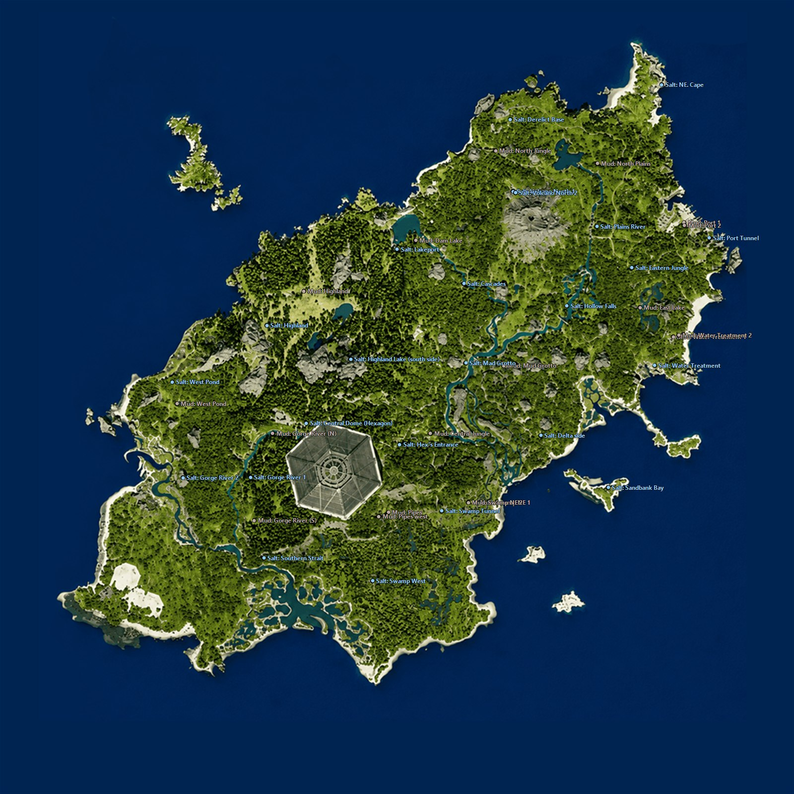
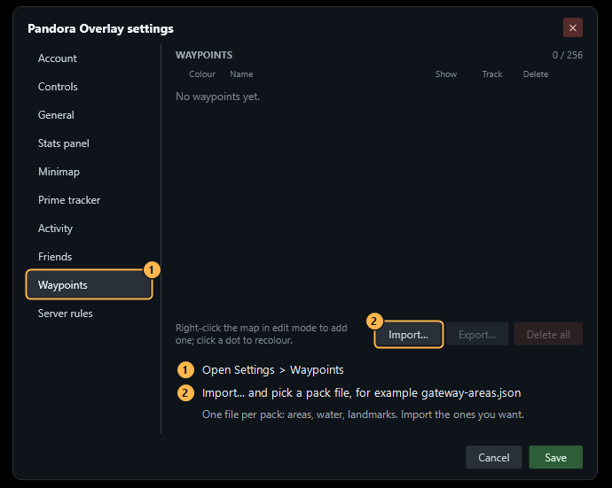
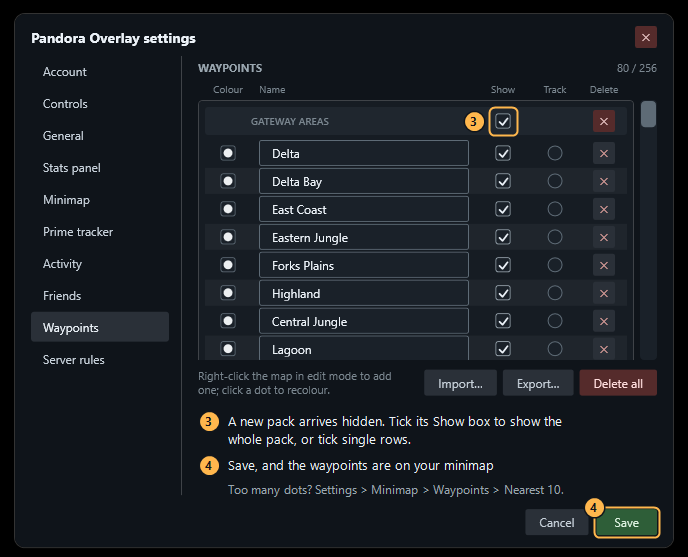

# Waypoint packs

Ready-made packs for the overlay's waypoint library: the island's place names, mud pools and salt rocks as waypoints you can import. 122 places in five files, so you can take only what you want.

| File | Pack | Waypoints | What's in it |
|---|---|---|---|
| [`gateway-areas.json`](gateway-areas.json) | Gateway areas | 26 | The regions: Highland, Swamps, South Plains, The Pit, Delta, Northern Jungle and the rest, plus the bays and beaches. |
| [`gateway-water.json`](gateway-water.json) | Gateway water | 27 | Lakes, ponds, rivers and falls: North Lake, Dam Lake, Highland Lake, Gorge River, Rock Pond and more. |
| [`gateway-landmarks.json`](gateway-landmarks.json) | Gateway landmarks | 27 | The dam, the Central Dome, the radio tower, the bridges, the volcano, the fifteen human sites and the two tunnels. |
| [`gateway-mud.json`](gateway-mud.json) | Gateway mud | 18 | The mud pools, one waypoint per pool: "Mud: Dam Lake", "Mud: Highland", "Mud: Pipes"… Where one spot has two pools they are numbered. |
| [`gateway-saltrocks.json`](gateway-saltrocks.json) | Gateway salt rocks | 24 | The salt rocks. They have no names of their own, so each is named after the nearest named place: "Salt: Cascades", "Salt: Volcano North 1"… |

To download one, open it here on GitHub and use the **Download raw file** button at the top right of the file view.

## Importing a pack

1. Open **Settings → Waypoints** (the tray icon, or **Settings…** in the edit-mode control panel).
2. Click **Import…** and pick a pack file. Import one file per pack.

3. A new pack arrives **hidden**, so it can't bury your map. Tick the **Show** box on the pack's row to show all of it, or tick single rows.
4. **Save**, and the waypoints are on your minimap.

## Good to know

- With a pack shown, the minimap's footer names the nearest place and how far away it is. **Track** one to keep its distance and an ETA in the footer wherever you go.
- Too many dots? **Settings → Minimap → Waypoints → Nearest 10** only draws the ten closest to you. The ✕ on a pack's row removes the whole pack.
- Your own waypoints are never touched, and importing the same pack again adds nothing: entries you already have are skipped.
- An area is a region, and a waypoint is a dot: the areas pack marks roughly the middle of each one. A few are out at sea on purpose (the bays, the East Coast, the Port).
- A salt rock's name only says which named place is closest, and that can be several hundred metres away. The dot is the rock.
- You can rename, recolour or delete any of them after the import, like any other waypoint.

## Where the data comes from

The names and positions come from [VulnonaMAP](https://vulnona.com/game/map/), the community-made interactive map for The Isle, from its data for Gateway v0.21.772, copied on 2026-09-30 (areas, water, landmarks) and 2026-10-01 (mud, salt rocks). Thanks to its makers and contributors. Each file names that source.

The packs are a snapshot: they are not updated by themselves when the island changes with a game update, and the overlay never contacts VulnonaMAP. Some of the names were given by the community rather than by the game.
